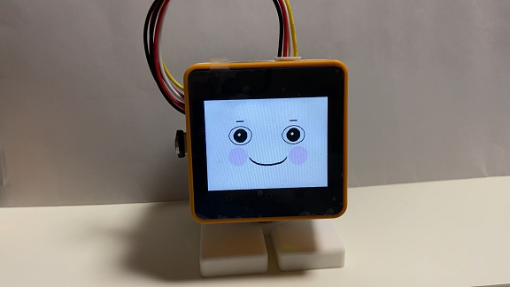
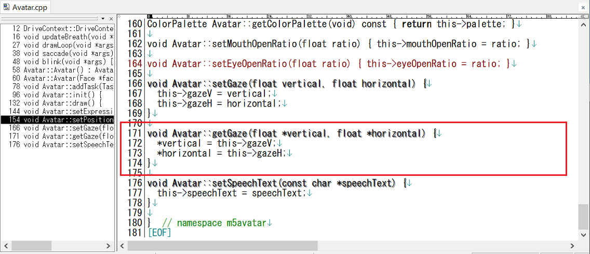
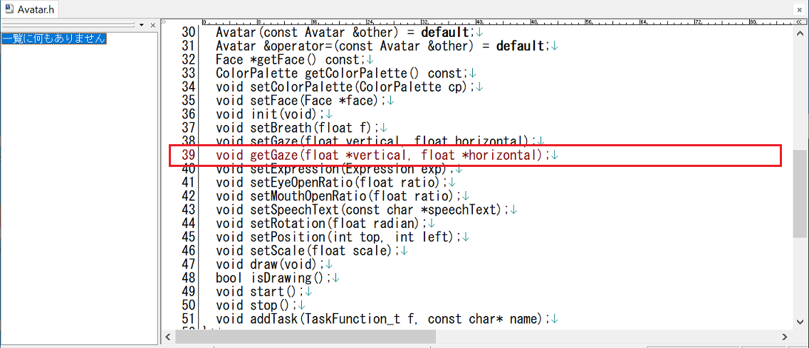
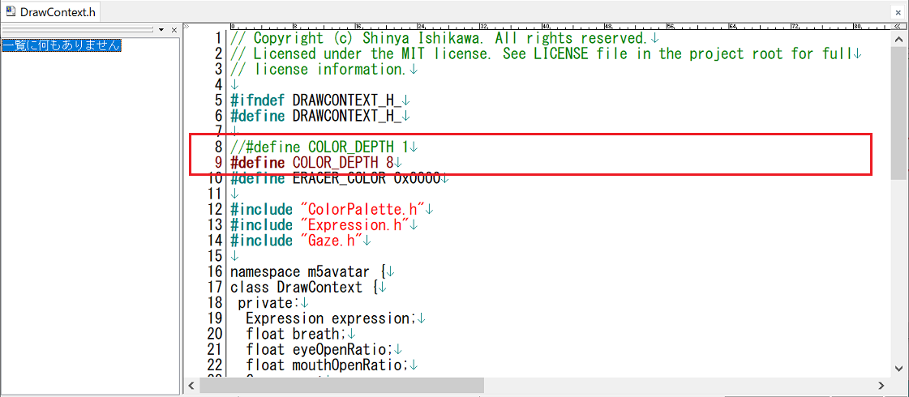
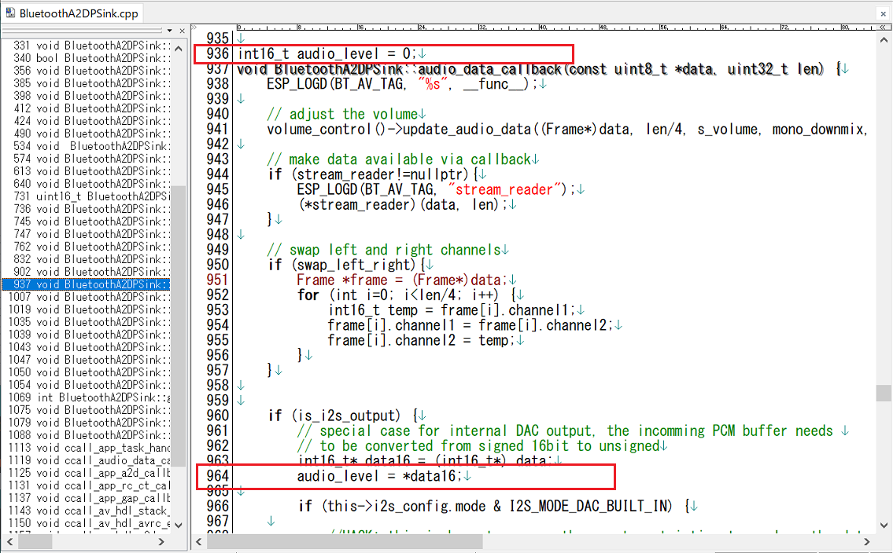

# M5Core2_SG90_StackChan_BTSPK
Bluetooth Speaker StackChan

@mongonta555 さんが[ｽﾀｯｸﾁｬﾝ M5GoBottom版組み立てキット](https://raspberrypi.mongonta.com/about-products-stackchan-m5gobottom-version/ "Title")の頒布を始められたので、それに対応したBluetooth Speakerｽﾀｯｸﾁｬﾝファームを作りました。 

 

---
### M5GoBottom版ｽﾀｯｸﾁｬﾝ本体を作るのに必要な物、及び作り方 ###
こちらを参照してください。 
* [ｽﾀｯｸﾁｬﾝ M5GoBottom版組み立てキット](https://raspberrypi.mongonta.com/about-products-stackchan-m5gobottom-version/ "Title") 

### このプログラムをビルドするのに必要な物 ###
* Arduino IDE (バージョン 1.8.15で動作確認をしました。) 
* [M5Stack-Avatar](https://github.com/meganetaaan/m5stack-avatar/ "Title")ライブラリ(バージョン 0.7.4で動作確認をしました。) 
* [ServoEasing](https://github.com/ArminJo/ServoEasing/ "Title")ライブラリ(バージョン 2.4.0で動作確認をしました。) 
* [ESP32Servo](https://github.com/madhephaestus/ESP32Servo/ "Title")ライブラリ(バージョン 0.9.0で動作確認をしました。) 
* [ESP32-A2DP](https://github.com/pschatzmann/ESP32-A2DP/ "Title")ライブラリ 
 

### M5Stack-Avatarライブラリを変更する ###
Windows11の場合はライブラリのソースはここにあります。 
C:\Users\ユーザー名\Documents\Arduino\libraries\m5stack-avatar 

* "Avatar.cpp""Avatar.h"の下図赤枠部分を追加します。
   
   
* "DrawContext.h"の下図赤枠部分を変更します。
   

### ESP32-A2DPライブラリを変更する ###
* "BluetoothA2DPSink.cpp"の下図赤枠部分を追加します。 
 
  

---
### M5Stack-SD-Updaterに対応させる場合 ###

* [M5Stack-SD-Updater](https://github.com/tobozo/M5Stack-SD-Updater/ "Title")ライブラリが必要です。 
* "M5Core2_SG90_StackChan_BTSPK.ino"の17行目のコメントを外して"#define USE_SD_UPDATER"を有効にします。 

M5Stack-SD-Updaterの使い方はこちらを参照してください。：<https://github.com/tobozo/M5Stack-SD-Updater>

---

### 使い方 ###
* スマホなどでペアリングを選択すると"Avatar"というデバイスが表示されるので選択して接続してください。 
* M5Stack Core2のボタンA,B,Cを押すと、それぞれ異なった顔を表示します。　 
  

